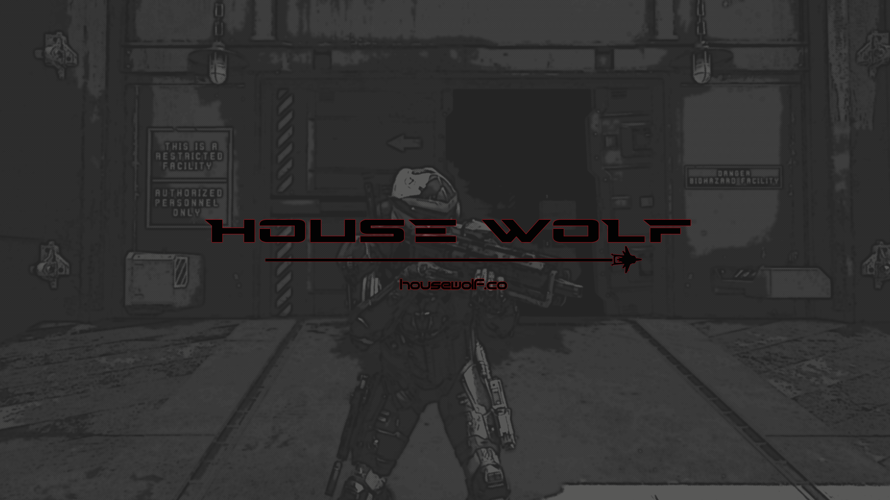
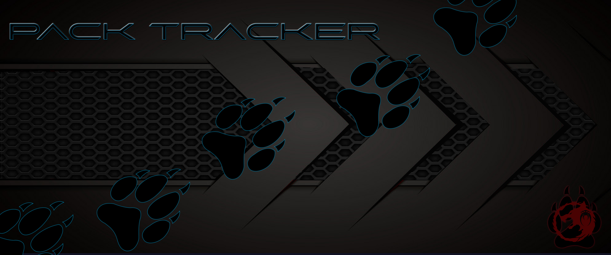
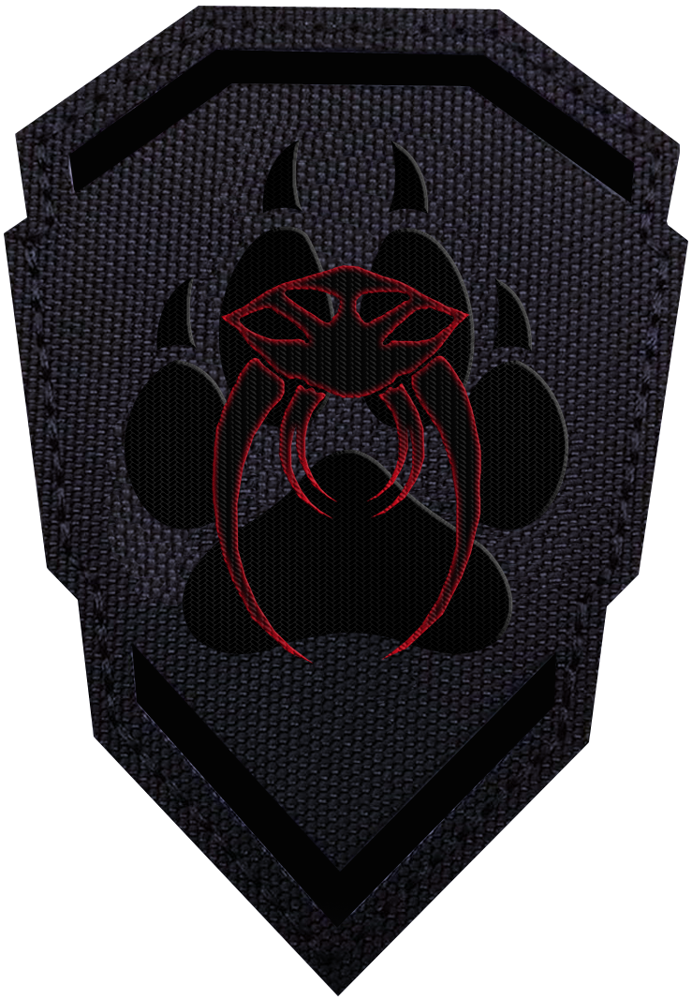
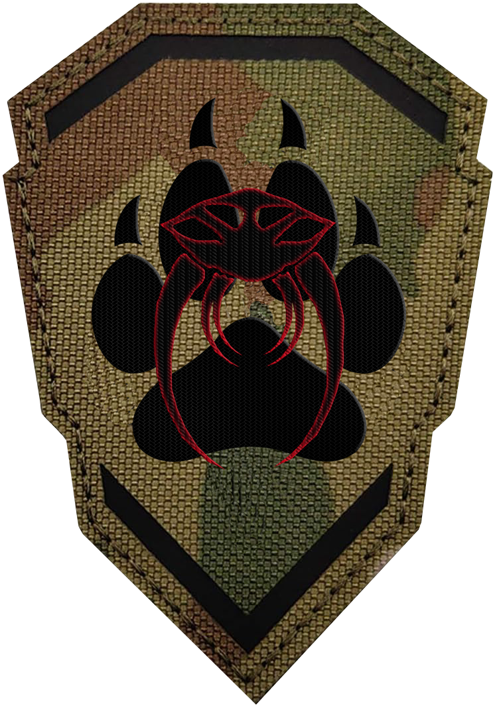
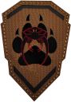
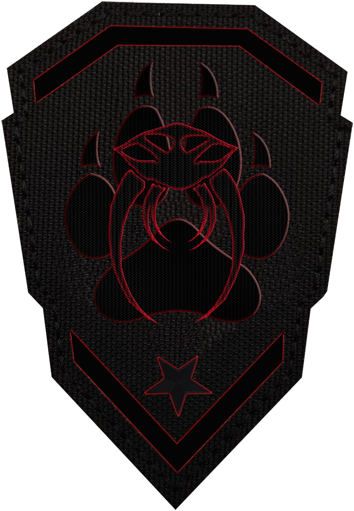
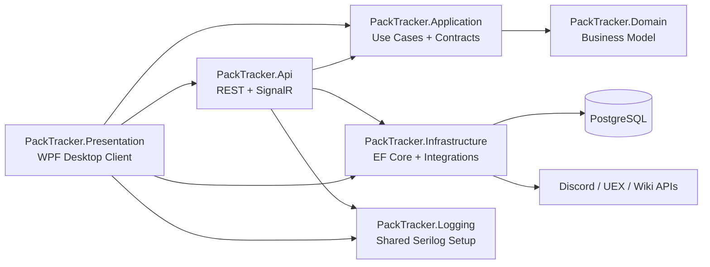

# PackTracker

  

  <strong>Operations, logistics, crafting, and member coordination for Star Citizen organizations.</strong>

  
  
  
  
  
  

---

## Overview

PackTracker is a desktop-first command platform built for Star Citizen groups that need more than a spreadsheet and a Discord server. It combines a WPF client, a shared ASP.NET Core API, real-time updates through SignalR, and a PostgreSQL-backed data layer to coordinate requests, logistics, crafting, trading data, and member activity in one place.

The repository is organized around Clean Architecture boundaries so the same core application logic can power both the standalone API and the embedded API hosted by the desktop shell.

---

## Table of Contents

- [Highlights](#highlights)
- [Feature Areas](#feature-areas)
- [Architecture](#architecture)
- [Repository Layout](#repository-layout)
- [Quick Start](#quick-start)
- [Configuration and Secrets](#configuration-and-secrets)
- [Testing](#testing)
- [Deployment and Publishing](#deployment-and-publishing)
- [Documentation](#documentation)
- [Screenshot Notes](#screenshot-notes)

---

## Highlights

| Area | What it covers |
| --- | --- |
| Operations Dashboard | Central landing area for coordination, visibility, and real-time activity |
| Request Workflows | Crafting, procurement, and assistance requests with status tracking |
| Trading Hub | UexCorp-backed commodity intelligence for route and profit decisions |
| Blueprint Explorer | Blueprint lookup, ownership tracking, and crafting input visibility |
| Discord Integration | Authentication and org-connected workflows |
| Shared Hosting Model | Same API composition for standalone server and embedded desktop host |

<strong>Why this structure matters</strong>

PackTracker is not just a UI shell. The desktop app hosts or connects to an API, uses shared application services, and keeps infrastructure concerns out of the domain layer. That reduces drift between local desktop usage and server-backed deployment, which is especially important for authentication, middleware, database initialization, and real-time messaging.

---

## Feature Areas

### Command Surface

  

PackTracker currently exposes a broad operations surface across the desktop app and API:

- dashboard and organization chat
- trading hub with commodity route analysis
- blueprint exploration and ownership tracking
- crafting request management
- procurement request workflows
- assistance and general support requests
- profiles, authentication, and Discord-connected access
- wiki sync and external data ingestion

<strong>Implemented views and controllers</strong>

Desktop views include `DashboardView`, `UexView`, `BlueprintExplorerView`, `CraftingRequestsView`, `ProcurementRequestsView`, `RequestsView`, `ProfileView`, `SettingsView`, and `HelpView`.

API controllers include `DashboardController`, `UexController`, `BlueprintsController`, `BlueprintOwnershipController`, `CraftingRequestsController`, `AssistanceRequestsController`, `ProfilesController`, `DiscordController`, `AuthController`, `RequestController`, `GuideRequestController`, and `WikiSyncController`.

### Operations and Real-Time Coordination

  

The dashboard is designed to act as a live coordination surface instead of a static admin panel. SignalR is used for real-time communication and request broadcasting so operators can react without manual refresh loops.

<strong>More detail</strong>

- channel-based communication and direct messaging are documented in the desktop user guide
- online presence and fleet coordination are part of the dashboard experience
- the API exposes a SignalR hub and shared composition path for both standalone and embedded hosting
- the desktop shell can either connect to a remote API or host the local API automatically when configured for loopback use

### Trading, Blueprints, and Crafting

  

PackTracker goes beyond task tracking by integrating market intelligence and blueprint data into request workflows. That gives users a path from planning, to sourcing, to fulfillment.

<strong>More detail</strong>

- the Trading Hub pulls commodity data from UexCorp
- route analysis includes price, ROI, and profit-per-SCU style decision support
- the Blueprint Explorer provides searchable crafting data and ownership tracking
- crafting requests can be initiated from blueprint flows
- procurement workflows support material acquisition for crafting and operations
- wiki sync services ingest blueprint and item data from external sources

### Requests, Logistics, and Member Support

  

The request system is split by operational intent so teams can manage general assistance separately from production and logistics work.

<strong>More detail</strong>

- assistance requests cover combat, mining, medical, and general operational support
- crafting requests track status, assignees, and completion
- procurement requests support material logistics and linked fulfillment
- dashboard summaries aggregate active work into a command-friendly view
- tests in `PackTracker.ApiTests` cover request behavior and API interaction patterns

### Identity, Roles, and Recognition

  

PackTracker includes organization-facing identity and recognition systems, including role-aware behavior and medal assets used by the desktop application.

<strong>More detail</strong>

- Discord OAuth is part of the authentication flow
- guild membership requirements can be configured through settings
- user profiles track organization identity information
- medal images and recognition assets live under `PackTracker.Presentation/Assets/medals`
- role and profile data are used across request ownership, dashboard summaries, and authorization-sensitive flows

---

## Architecture

PackTracker follows Clean Architecture boundaries with shared composition between the desktop-hosted API and the standalone API.

<strong>Layer responsibilities</strong>

| Layer | Responsibility |
| --- | --- |
| `PackTracker.Domain` | Entities, enums, and business state with no infrastructure dependency |
| `PackTracker.Application` | DTOs, service contracts, options, and orchestration logic |
| `PackTracker.Infrastructure` | EF Core, settings persistence, token services, updater logic, and external integrations |
| `PackTracker.Api` | Controllers, middleware, hosting composition, and SignalR |
| `PackTracker.Presentation` | WPF views, view models, embedded API lifecycle, and desktop startup |
| `PackTracker.Logging` | Shared logging configuration and Serilog wiring |

---
## Documentation

- [Architecture](docs/architecture.md)
- [Local Development](docs/local-development.md)
- [Configuration and Secrets](docs/configuration-and-secrets.md)
- [Deployment](docs/deployment.md)
- [Updater Flow](docs/updater-flow.md)
- [Dependency Rules](docs/dependency-rules.md)
- [Refactor Report](docs/refactor-report.md)

---

## License

This repository is licensed under the [MIT License](LICENSE).
